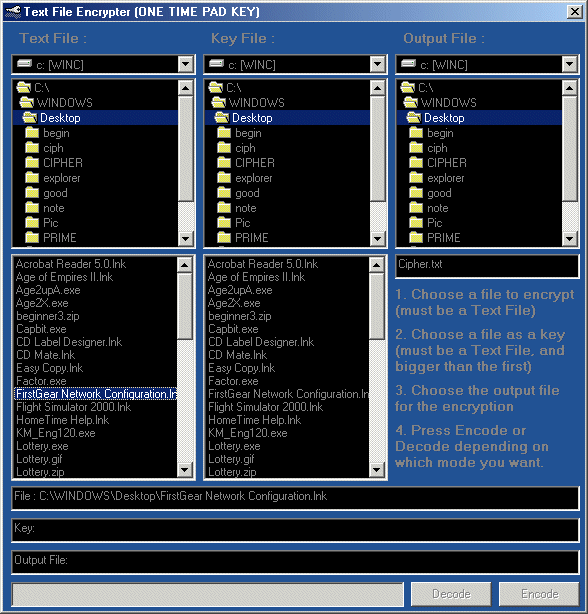



## Encrypt File using another File

### Description

This Program encrypts and decrypts a file using antoher file, this when properly used can be a one time pad key. The Key file could be transfer to disc and used as a Key Card. Fully Commented
 
### More Info
 

             |
---                |---
**Submitted On**   |2001-12-29 19:36:12
**By**             |[Kevin Pfister](https://github.com/Planet-Source-Code/PSCIndex/blob/master/ByAuthor/kevin-pfister.md)
**Level**          |Intermediate
**User Rating**    |4.0 (16 globes from 4 users)
**Compatibility**  |VB 6\.0
**Category**       |[Complete Applications](https://github.com/Planet-Source-Code/PSCIndex/blob/master/ByCategory/complete-applications__1-27.md)
**World**          |[Visual Basic](https://github.com/Planet-Source-Code/PSCIndex/blob/master/ByWorld/visual-basic.md)
**Archive File**   |[Encrypt\_Fi4461912292001\.zip](https://github.com/Planet-Source-Code/kevin-pfister-encrypt-file-using-another-file__1-30207/archive/master.zip)

